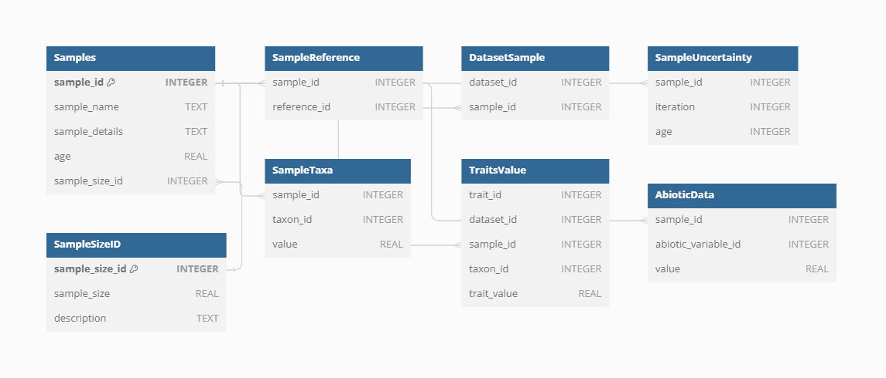
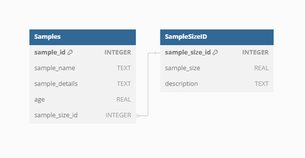
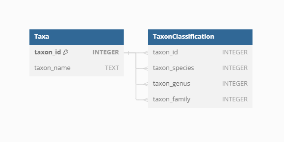
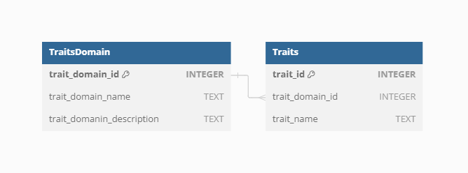
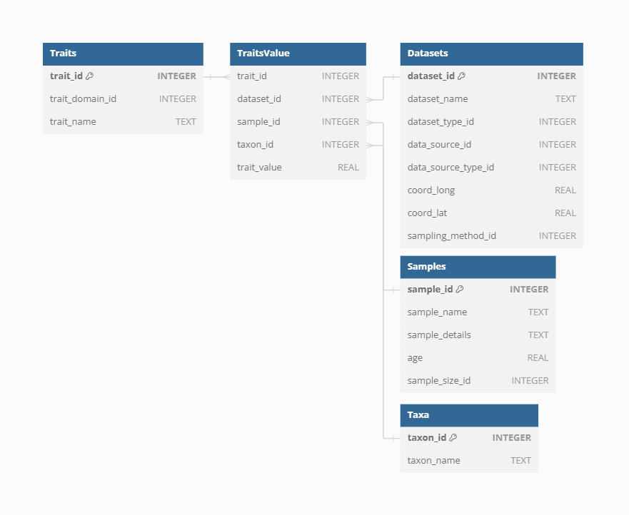
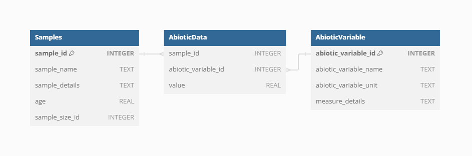

# Section I: Description of VegVault


**VegVault** is a SQLite interdisciplinary database linking plot-based
vegetation data with functional traits and climate. Specifically, it
contains:

- current vegetation plot data
- past vegetation plot data (fossil pollen records)
- functional trait data
- current abiotic data (climate, soil)
- past abiotic data (climate)

The goal of the database is to compile interdisciplinary data …

# Section II: Overview of VegVault 1.0.0


The database is structured in several logical levels, such as `Dataset`,
`Sample`, `Taxa`, `Trait`, etc.

## Dataset

`Dataset` represents the highest levels in the hierarchy. It is the main
keystone in the VegVault structure.


### Dataset Type

`dataset_type_id` defines the basic type of a dataset. This is the
highest level of classification of the data

Currently, there **VegVault** consist of those types:

- **vegetation_plot** - current vegetation plot dataset
- **fossil_pollen_archive** - past vegetation plot dataset
- **traits** - dataset containing functional traits
- **gridpoints** - artificially created dataset to hold abiotic data


### Dataset Source-Type

`dataset_source_type_id` defines the general provider of the dataset.
This should help to classify, which data pipeline was used to import the
dataset into the **VegVault**, This is also the first general point of
reference of data, as all large databases have a citation statement.

Currently, the **VegVault** consist of those source-types:

- **BIEN** - [Botanical Information and Ecology
  Network](https://bien.nceas.ucsb.edu/bien/)
- **sPlotOpen** - [The open-access version of
  sPlot](https://idiv-biodiversity.de/en/splot/splotopen.html)
- **TRY** - [TRY Plant Trait
  Database](https://www.try-db.org/TryWeb/Home.php)
- **FOSSILPOL** - [The workflow that aims to process and standardise
  global palaeoecological pollen
  data](https://hope-uib-bio.github.io/FOSSILPOL-website/)
- **gridpoints** - artificially created dataset to hold abiotic data


### Dataset Source

Each individual dataset from a specific *Data Source-Type* can have
information on the source of the data (i.e. sub-database). This should
help to promote better findability of the primary source of data and
referencing.


Currently, there are 706 sources of datasets.


### Sampling method

Some datasets may differ in the way they have been sampled. This could
be represented by different ways vegetation data have been sampled for
*Dataset Type* of `vegetation_plot`, or depositional environment for
*Dataset Type* of `fossil_pollen_archive`.


### References

*Dataset Source-Type*, *Dataset Source*, and *Sampling Method* can have
their own references. Moreover, each dataset can have one or more
references directly to that specific data.


This means that one dataset can have one/several references from each of
those parts. Let’s take a look at an example, of what that could mean in
practice.

We have selected dataset ID: 91256, which is a fossil pollen archive.
Therefore, it has the reference of the *Dataser Source-Type*:
*https://doi.org/10.1111/geb.13693* and reference for the individual
dataset: *Grimm, E.C., 2008. Neotoma: an ecosystem database for the
Pliocene, Pleistocene, and Holocene. Illinois State Museum Scientific
Papers E Series, 1.*


## Samples

`Sample` represents the main unit of data in the **VegVault** database.



### Dataset-Sample

First `Samples` are linked to `Datasets` via the `Dataset-Sample` table.


### Sample-size

Vegetation plots can have different sizes, which can have a huge impact
on analyses. Therefore, the information about the plot is saved
separately.




### Sample age

The **VegVault** database deals with both current and paleo data.
Therefore, each `Sample` has the indication of *age*, with modern
samples being set to 0. To embrace the uncertainty from age-depth
modeling paleo-record, the **VegVault** database has a structure to hold
an uncertainty matrix containing information about all *potential ages*
of each `Sample` from a paleo `Dataset`.


We can show this on the previously selected fossil pollen archive with
dataset ID: 91256.


### Sample reference

Individual `Sample` can have specific references on top of the reference
to `Dataset`


## Taxa

The **VegVault** database contains taxa names directly from main *Data
Source-types*.


Individual taxa names are linked to the `Samples` by the `SampleTaxa`
table.


### Classification

In order to obtain classification of all taxa present in the
**VegVault** database, the
{[taxospace](https://github.com/OndrejMottl/taxospace)} R package has
been utilized, automatically aligning the names to [Taxonomy
Backbone](https://www.gbif.org/dataset/d7dddbf4-2cf0-4f39-9b2a-bb099caae36c)
from [Global Biodiversity Information Facility](https://www.gbif.org/).

Classification up to the family level is then saved for each taxon.




## Traits

Functional traits of vegetation taxa follow the same structure of
`Dataset` and `Samples` obtained directly from *Dataset Source-types*.


### Trait domain

As there are many varying names for the same “traits”, the **VegVault**
database contains *Trait Domain* information to group traits together.



There are currently 6 trait domains following the [Diaz et
al. (2016)](https://www.nature.com/articles/nature16489)

| Trait domain                        |
|-------------------------------------|
| Stem specific density               |
| Leaf nitrogen content per unit mass |
| Diaspore mass                       |
| Plant heigh                         |
| Leaf Area                           |
| Leaf mass per area                  |


### Trait Values

To store a trait value, information needs to be linked among `Dataset`,
`Sample`, `Taxa`, and `Trait`.




### Trait reference

For full clarity, on top of `Dataset` and `Sample`, each `Trait` can
have additional references.


## Abiotic data

Abiotic data is aimed to provide information about all relevant abiotic
information affecting vegetation distribution and its traits.

Abiotic data is linked to the structure of the **VegVault** Database by
the `gridpoints`, which are artificially created points to *reasonably*
cover the resolution of both modern and past data for vegetation and
abiotic data.


There are currently abiotic from [CHELSA](https://chelsa-climate.org/)
and [CHELSA-TRACE21](https://chelsa-climate.org/chelsa-trace21k/) and
[WoSIS](https://www.isric.org/explore/wosis). CHELSA and CHELSA-TRACE21
are built on the same structure of variables (visit the websites for
more info).

| Variable name | Variable unit    | source of data  |
|---------------|------------------|-----------------|
| bio1          | °C              | CHELSA          |
| bio4          | °C              | CHELSA          |
| bio6          | °C              | CHELSA          |
| bio12         | kg m-2 year-1    | CHELSA          |
| bio15         | Unitless         | CHELSA          |
| bio18         | kg m-2 quarter-1 | CHELSA          |
| bio19         | kg m-2 quarter-1 | CHELSA          |
| HWSD2         | Unitless         | WoSIS-SoilGrids |

Abiotic data is simply linked to `Samples`.




Note that the spatial resolution is higher for modern climate data than
for the past. This is to reduce the size of the past climate data.


# Section III: Assembly details of VegVault 1.0.0


The **VegVault** version **1.0.0** has been assembled from other
publicly available databases.

## Assembly process

Here is a general visualisation of the assembly process:


**Figure legend**:

1.  **[Neotoma Paleoecology Database](https://www.neotomadb.org/)** -
    open, community-curated data and services for paleoecological and
    paleoenvironmental data
    - source of fossil pollen data
2.  **[sPlotOpen](https://idiv-biodiversity.de/en/splot/splotopen.html)** -
    The open-access version of sPlot
    - source of current vegetation plot data
3.  **[Botanical Information and Ecology
    Network](https://bien.nceas.ucsb.edu/bien/)** - global patterns of
    plot inventories and surveys
    - source of current vegetation plot and vegetation trait data
4.  **[TRY Plant Trait
    Database](https://www.try-db.org/TryWeb/Home.php)** - open access
    plant trait data
    - source of vegetation trait data
5.  **[Climatologies at High resolution for the Earth’s Land Surface
    Area](https://chelsa-climate.org/)** - Long-term, transient modern-
    and paleo-climate data
    - source of abiotic data
6.  **[World Soil Information
    Service](https://www.isric.org/explore/wosis)** - harmonised soil
    profile database
    - source of abiotic data
7.  **[FOSSILPOL](https://hope-uib-bio.github.io/FOSSILPOL-website/)** -
    The workflow that aims to process and standardise global
    palaeoecological pollen data for macroecological studies
    - a method to obtain and process fossil pollen data
8.  **[RBIEN R package](https://github.com/bmaitner/RBIEN)** - Tools for
    accessing the BIEN database
    - a method to obtain current vegetation plot data
9.  **[VegVault-FOSSILPOL GitHub
    repo](https://github.com/OndrejMottl/VegVault-FOSSILPOL/tree/v1.0.0)**
    - a Tag (v1.0.0) to obtain and process fossil pollen data
10. **[VegVault-Vegetation_data GitHub
    repo](https://github.com/OndrejMottl/VegVault-Vegetation_data/tree/v1.0.0)**
    - a Tag (v1.0.0) to process current vegetation plot data
11. **[VegVault-Trait_data GitHub
    repo](https://github.com/OndrejMottl/VegVault-Trait_data/tree/v1.1.0)**
    - a Tag (v1.1.0) to process vegetation trait data
12. **[VegVault-abiotic_data GitHub
    repo](https://github.com/OndrejMottl/VegVault-abiotic_data/tree/v1.1.0)**
    - a Tag (v1.1.0) to process abiotic data
13. **[VegVault GitHub repo](https://github.com/OndrejMottl/VegVault)**
    - a Tag (v1.0.0) to transfer the data into the SQLite database
14. **VegVault** - SQLite database (v1.0.0)

### Note on GitHub Tags

*…Tags are ref’s that point to specific points in Git history. Tagging
is generally used to capture a point in history…*

Here, the Tags have been used to ensure reproducibility of this version
of **VegVault**. GitHub repo can change but the specific Tag used here
(and also used in the code to source the data) ensure the transparency
of the state of the database.

# Section IV: Examples of usage


The **VegVault** database can be accessed via our newly developed
[{vaultkeepr} R-package](https://github.com/OndrejMottl/vaultkeepr),
which provides a series of easy-to-use functions in [R programming
language](https://en.wikipedia.org/wiki/R_(programming_language)).

The {vaultkeepr} can be installed from [GitHub](https://github.com/)
with:

``` r
# install.packages("remotes")
remotes::install_github("OndrejMottl/vaultkeepr")
```

and then all functions will be made available by attaching as:

``` r
library(vaultkeepr)
```

## Example 1

In the first example, we can imagine a scenario, where we are interested
in spatiotemporal patterns of the *Picea* genus across North America for
modern data and since the Last Glacial Maximum. Obtaining such data is
straightforward:

``` r
# First create a plan
plan_na_plots_picea <-
  # Access the VegVault
  vaultkeepr::open_vault(
    path = paste0(
      data_storage_path,
      "Data/VegVault/VegVault.sqlite"
    )
  ) %>%
  # Start by adding dataset information
  vaultkeepr::get_datasets() %>%
  # Select both modern and paleo plot data
  vaultkeepr::select_dataset_by_type(
    sel_dataset_type = c(
      "vegetation_plot",
      "fossil_pollen_archive"
    )
  ) %>%
  # Limit data to North America
  vaultkeepr::select_dataset_by_geo(
    lat_lim = c(22, 60),
    long_lim = c(-135, -60)
  ) %>%
  # Add samples
  vaultkeepr::get_samples() %>%
  # Limit the samples by age
  vaultkeepr::select_samples_by_age(
    age_lim = c(0, 15e3)
  ) %>%
  # Add taxa
  vaultkeepr::get_taxa(
    # Classify all data to a genus level
    classify_to = "genus"
  ) %>%
  # Extract only Picea data
  vaultkeepr::select_taxa_by_name(sel_taxa = c("Picea"))

# Execute the plan
data_na_plots_picea <-
  vaultkeepr::extract_data(plan_na_plots_picea)
```

Now, we plot the presence of *Picea* in each 2500-year bin.


## Example 2

In the second example, let’s imagine we want to do Species Distribution
Modeling for all plant taxa in the Czech Republic. We will extract
modern plot-based data and Mean Annual temprature.

``` r
# Again start by creating a plan
plan_cz_modern <-
  # Acess the VegVault file
  vaultkeepr::open_vault(
    path = paste0(
      data_storage_path,
      "Data/VegVault/VegVault.sqlite"
    )
  ) %>%
  # Add the dataset information
  vaultkeepr::get_datasets() %>%
  # Select modern plot data and climate
  vaultkeepr::select_dataset_by_type(
    sel_dataset_type = c(
      "vegetation_plot",
      "gridpoints"
    )
  ) %>%
  # Limit data to Czech Republic
  vaultkeepr::select_dataset_by_geo(
    lat_lim = c(48.5, 51.1),
    long_lim = c(12, 18.9)
  ) %>%
  # Add samples
  vaultkeepr::get_samples() %>%
  # select only modern data
  vaultkeepr::select_samples_by_age(
    age_lim = c(0, 0)
  ) %>%
  # Add abiotic data
  vaultkeepr::get_abiotic() %>%
  # Select only Mean Anual Temperature (bio1)
  vaultkeepr::select_abiotic_var_by_name(
    sel_var_name = "bio1"
  ) %>%
  # add taxa
  vaultkeepr::get_taxa()

# Execute the plan
data_cz_modern <-
  vaultkeepr::extract_data(plan_cz_modern)
```

Now we can simply plot both the climatic data and the plot vegetation
data:


## Example 3

In the last example, let’s imagine we want to reconstruct the Community
Weighted Mean (CWM) of plant height for Latin America between 6-12 ka yr
BP.

``` r
# Again start by creating a plan
plan_la_traits <-
  # Acess the VegVault file
  vaultkeepr::open_vault(
    path = paste0(
      data_storage_path,
      "Data/VegVault/VegVault.sqlite"
    )
  ) %>%
  # Add the dataset information
  vaultkeepr::get_datasets() %>%
  # Select modern plot data and climate
  vaultkeepr::select_dataset_by_type(
    sel_dataset_type = c(
      "fossil_pollen_archive",
      "traits"
    )
  ) %>%
  # Limit data to Latin America
  vaultkeepr::select_dataset_by_geo(
    lat_lim = c(-53, 28),
    long_lim = c(-110, -38),
    sel_dataset_type = c(
      "fossil_pollen_archive",
      "traits"
    )
  ) %>%
  # Add samples
  vaultkeepr::get_samples() %>%
  # Limit to 6-12 ka yr BP
  vaultkeepr::select_samples_by_age(
    age_lim = c(6e3, 12e3)
  ) %>%
  # add taxa
  vaultkeepr::get_taxa(
    # Clasify all data to a genus level
    classify_to = "genus"
  ) %>%
  # add trait information
  vaultkeepr::get_traits(
    # Clasify all data to a genus level
    classify_to = "genus"
  ) %>%
  # Only select the plant height
  vaultkeepr::select_traits_by_domain_name(
    sel_domain = "Plant heigh"
  )

# Execute the plan
data_la_traits <-
  vaultkeepr::extract_data(plan_la_traits)
```

Now let’s plot the overview of the data


# Section V: Outlook and future directions


