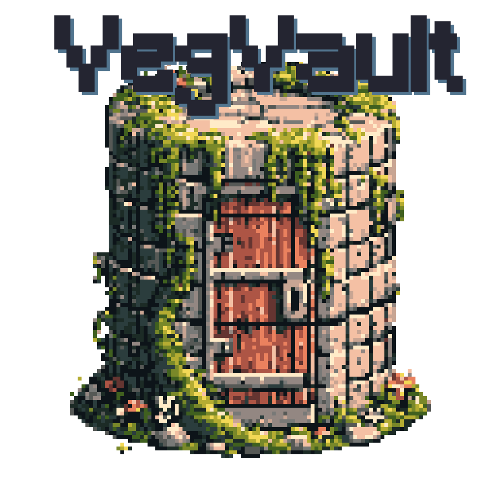

<!-- README.md is generated from README.qmd. Please edit that file -->

# VegVault database 

<!-- badges: start -->
<!-- badges: end -->

This is part of the [BIODYNAMICS
project](https://ondrejmottl.github.io/projects/BIODYNAMICS/).

The goal of this repo is to create SQL-like datasase with all data from
[BIODYNAMICS](https://ondrejmottl.github.io/projects/BIODYNAMICS/).
