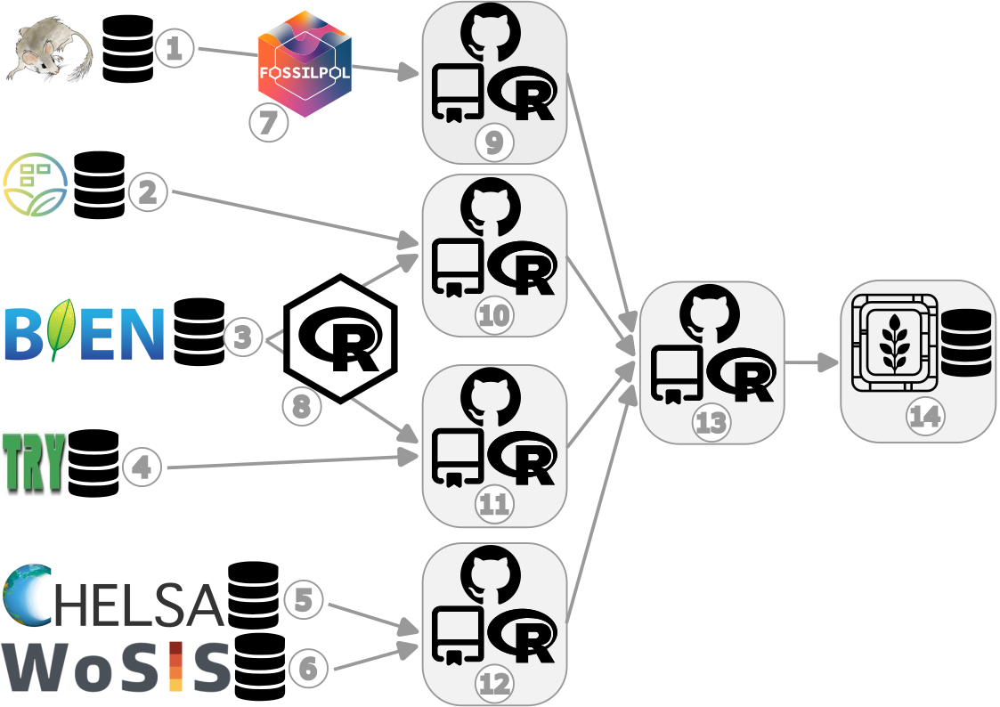

# Section I: Description of VegVault


**VegVault** is a SQLite interdisciplinary database linking plot-based
vegetation data with functional traits and climate.

Vault integrates data from multiple well-established sources to provide
a comprehensive view of vegetation dynamics. By organizing data into
clearly defined types and providing comprehensive referencing, VegVault
supports detailed and high-quality ecological research. This structured
approach ensures that data are accessible, reliable, traceable, and
facilitate a wide range of analyses and applications across disciplines.
See the Data Acquisition section for more details about reproducibility.

## Data Structure

VegVault is organized into several section to systematically manage the
varying datasets it integrates. The main structure is the `Dataset`,
which serves as the cornerstone of the database structure. `Datasets`
are further linked to `Samples`, representing individual data points
within each dataset. Each `Dataset` can be linked to several `Samples`
only if the samples differ in their age. Moreover, Each `Dataset` is
classified into one of four types:

- current vegetation plots,
- past vegetation (fossil pollen records)
- functional traits
- gridpoint (a dataset type created to hold abiotic data, see details
  below).

For current and past vegetation `Dataset`, the `Samples` holds
information about their vegetation, and are linked to specific `Taxa`,
which are the taxa names derived directly from the main data sources.
`Trait` information is organised in separate `Datasets` (as they are
associated with unique information about their spatio-temporal location,
references, etc) but associated with these same `Taxa` codes as
vegetation data. Moreover, each `Taxa` disregard of the source is
associated with classification information (i.e. species, genus and
family name). “*Gridpoints*” are artificially created `Datasets` with
even spatio-temporal resolution to hold the abiotic information. While
the vegetation data is the main focus of the database, the structure of
using separete `Datasets` ensuree a comprehensive organization of the
data (see Figure XXX). Note that this is just a simplified description
of the database structure, see XXX for full database structure.

# Section II: Overview of VegVault 1.0.0


## Dataset

The `Dataset` represents the main structure in the VegVault, serving as
the keystone for organizing and managing data. Currently, the VegVault
database holds over 480,000 Datasets (of which approximately 100,000 are
gridpoints, which are artificially created to hold abiotic data, see
details below). Here we will explain some, but not all, of the features
of the `Dataset`.


### Dataset Type

The `Dataset Type` defines the most basic classification of each
`Dataset`, ensuring that the vast amount of data is categorized
systematically. Currently, **VegVault** contains the following types of
Datasets:

- `vegetation_plot`: This type includes current vegetation plot data,
  capturing contemporary vegetation characteristics and distributions.
- `fossil_pollen_archive`: This type encompasses past vegetation plot
  data derived from fossil pollen records, providing insights into
  historical vegetation patterns.
- `traits`: This `Dataset` contains functional trait data, detailing
  specific characteristics of plant species that influence their
  ecological roles.
- `gridpoints`: This type holds artificially created Datasets to manage
  abiotic data, such as climate and soil information


### Dataset Source-Type

Each `Dataset` is derived from a specific `Source-Type` provides
detailed information on the source, which was used to retrieve the
original data, enhancing the findability and referencing of primary data
sources. The current `Source-Types` in **VegVault** include

- **BIEN** - [Botanical Information and Ecology
  Network](https://bien.nceas.ucsb.edu/bien/)
- **sPlotOpen** - [The open-access version of
  sPlot](https://idiv-biodiversity.de/en/splot/splotopen.html)
- **TRY** - [TRY Plant Trait
  Database](https://www.try-db.org/TryWeb/Home.php)
- **FOSSILPOL** - [The workflow that aims to process and standardise
  global palaeoecological pollen
  data](https://hope-uib-bio.github.io/FOSSILPOL-website/). Note that we
  specifically state FOSSILPOL and not Neotoma, as FOSSILPOL not only
  provides the data but also alters it (e.g, new age-depth models).
- **gridpoints** - artificially created `Datasets` to hold abiotic data


### Dataset Source

Each individual `Dataset` from a specific `Dataset` `Source-Type` can
have information on the source of the data (i.e. sub-database). This
should help to promote better findability of the primary source of data
and referencing.


Currently, there are 706 sources of datasets.


### Sampling method

Sampling methods vary significantly across the different types of
`Datasets` integrated into **VegVault**, reflecting the diverse nature
of the data collected. For current vegetation plots, sampling involves
standardized plot inventories and surveys that capture detailed
vegetation characteristics across various regions. In contrast, fossil
pollen data are collected from sediment cores, representing past
vegetation and depositional environments. These sampling methods are
crucial for understanding the context and limitations of each Dataset
Type. Therefore, information on sampling methods is only present for
both `vegetation_plot` and `fossil_pollen_archive` `Datasets`, providing
metadata that ensures accurate and contextually relevant analyses


### References

To support robust and transparent scientific research, each `Dataset` in
**VegVault** can have multiple references at different levels. The
`Dataset` `Source-Type`, `Dataset Source`, and `Sampling Method` can all
have their own references, providing detailed provenance and citation
information. This multi-level referencing system enhances the
traceability and validation of the data. **VegVault** currently includes
706 sources of `Datasets`, each documented to ensure reliability and
ease of use. Each dataset can also have one or more direct references to
specific data, further ensuring that users can accurately cite and
verify the sources of their data.


This means that one dataset can have one/several references from each of
those parts. Let’s take a look at an example, of what that could mean in
practice.

We have selected dataset ID: 91256, which is a fossil pollen archive.
Therefore, it has the reference of the *Dataser Source-Type*:
*https://doi.org/10.1111/geb.13693* and reference for the individual
dataset: *Grimm, E.C., 2008. Neotoma: an ecosystem database for the
Pliocene, Pleistocene, and Holocene. Illinois State Museum Scientific
Papers E Series, 1.*


## Samples

`Samples` represent the main unit of data in the **VegVault** database,
serving as the fundamental building blocks for all analyses. There are
currently over 13 millions of `Samples` in the **VegVault** database (of
which ~ 1.6 millions are `gridpoints`, artificially created to hold
abiotic data, see below).


### Dataset-Sample

Each sample is linked to a specific `Dataset` via the `Dataset-Sample`
table, which ensures that every sample is correctly associated with its
corresponding `Dataset Type`, whether it is current `vegetation_plots`,
`fossil_pollen_archive`, `traits`, or `gridpoint`.


### Sample-size

The size of vegetation plots can vary, impacting the analyses and
interpretations of the data. To account for this variability,
information about the plot size is recorded separately for each
`Sample`. This detail is crucial for ecological studies where plot size
can influence species diversity and abundance metrics.


### Sample age

**VegVault** encompasses both current and paleo data, necessitating
accurate age information for each sample. Modern samples are assigned an
age of 0, while paleo samples uses calibrated years before present (cal
yr BP). The “present” is here specified as 1950 AD. In addition, each
`Sample` from `fossil_pollen_archive` `Dataset` is also associated with
an uncertainty matrix. This matrix provides a range of potential ages
derived from age-depth modelling, reflecting the inherent uncertainty in
dating paleoecological records. For instance, we include detailed age
uncertainty information for a fossil pollen archive with an example
`Dataset`.


We can show this on the previously selected fossil pollen archive with
dataset ID: 91256.


### Sample reference

Each `Sample` in **VegVault** can have specific references in addition
to the `Dataset`-level references. These individual `Sample` references
provide detailed provenance and citation information, ensuring that
users can trace the origin and validation of each data point. This level
of referencing enhances the transparency and reliability of the data,
especially when the database continues to be updated in the future.


## Taxa

The **VegVault** database records taxa names derived directly from the
primary data sources. Each individual `Taxon` is linked to corresponding
`Samples` through the `SampleTaxa` table, ensuring accurate and
systematic association between species and their ecological data.


### Classification

To classify the diverse taxa present in the **VegVault** database, the
{[taxospace](https://github.com/OndrejMottl/taxospace)} R package was
used. This tool automatically aligns taxa names with the [Taxonomy
Backbone](https://www.gbif.org/dataset/d7dddbf4-2cf0-4f39-9b2a-bb099caae36c)
from the [Global Biodiversity Information
Facility](https://www.gbif.org/), providing a standardized
classification framework. Specifically, we try to find the best match of
the raw names of taxa using [Global Names
Resolver](https://resolver.globalnames.org/). Classification
information, detailed up to the family level, is stored for each taxon,
ensuring consistency and facilitating comparative analyses across
different datasets. Currently, the **VegVault** database holds over 110
thousand taxonomic names, of which we were unable to classify only 1312
(1.2%).


## Traits

Functional traits of vegetation taxa follow the same structure of
`Dataset` and `Samples` obtained directly from `Dataset` `Source-Types`.


### Trait domain

As there are differences in trait names across sources of data and
individual `Datasets`, the **VegVault** database contains `Trait Domain`
information to group traits together.


There are currently 6 `Trait Domains` following the [Diaz et
al. (2016)](https://www.nature.com/articles/nature16489)

| Trait domain                        | Trait                                                                                                       | Data source |
|-------------------------------------|-------------------------------------------------------------------------------------------------------------|-------------|
| Stem specific density               | stem wood density                                                                                           | BIEN        |
| Stem specific density               | Stem specific density (SSD, stem dry mass per stem fresh volume) or wood density                            | TRY         |
| Leaf nitrogen content per unit mass | leaf nitrogen content per leaf dry mass                                                                     | BIEN        |
| Leaf nitrogen content per unit mass | Leaf nitrogen (N) content per leaf dry mass                                                                 | TRY         |
| Diaspore mass                       | seed mass                                                                                                   | BIEN        |
| Diaspore mass                       | Seed dry mass                                                                                               | TRY         |
| Plant heigh                         | whole plant height                                                                                          | BIEN        |
| Plant heigh                         | Plant height vegetative                                                                                     | TRY         |
| Leaf Area                           | leaf area                                                                                                   | BIEN        |
| Leaf Area                           | Leaf area (in case of compound leaves undefined if leaf or leaflet, undefined if petiole is in- or exluded) | TRY         |
| Leaf Area                           | Leaf area (in case of compound leaves: leaf, petiole excluded)                                              | TRY         |
| Leaf Area                           | Leaf area (in case of compound leaves: leaf, petiole included)                                              | TRY         |
| Leaf Area                           | Leaf area (in case of compound leaves: leaf, undefined if petiole in- or excluded)                          | TRY         |
| Leaf mass per area                  | leaf mass per area                                                                                          | BIEN        |
| Leaf mass per area                  | Leaf area per leaf dry mass (specific leaf area, SLA or 1/LMA): petiole included                            | TRY         |
| Leaf mass per area                  | Leaf area per leaf dry mass (specific leaf area, SLA or 1/LMA): undefined if petiole is in- or excluded)    | TRY         |


### Trait Values

Storing trait values in **VegVault** involves linking information across
`Datasets`, `Samples`, `Taxa`, and `Traits`. This comprehensive linkage
ensures that each trait value is accurately associated with its relevant
ecological, environmental and taxonomic context.


### Trait reference

To ensure clarity and reproducibility, each trait in the **VegVault**
database can have additional `References` beyond the general `Dataset`
and `Sample` references. These trait-specific `References` provide
detailed provenance and citation information, supporting rigorous
scientific research and enabling users to trace the origins and
validation of each trait value.


## Abiotic data

The abiotic data in the **VegVault** database provide essential
information on environmental factors affecting vegetation distribution
and traits. These data include variables such as climate and soil
conditions, which are crucial for understanding the ecological contexts
of vegetation dynamics.

Currently, **VegVault** includes abiotic data from
[CHELSA](https://chelsa-climate.org/),
[CHELSA-TRACE21](https://chelsa-climate.org/chelsa-trace21k/), and
[WoSIS](https://www.isric.org/explore/wosis). CHELSA and CHELSA-TRACE21
provide high-resolution climate data, while WoSIS offers detailed soil
information.

| Variable name | Variable unit    | source of data  |
|---------------|------------------|-----------------|
| bio1          | °C              | CHELSA          |
| bio4          | °C              | CHELSA          |
| bio6          | °C              | CHELSA          |
| bio12         | kg m-2 year-1    | CHELSA          |
| bio15         | Unitless         | CHELSA          |
| bio18         | kg m-2 quarter-1 | CHELSA          |
| bio19         | kg m-2 quarter-1 | CHELSA          |
| HWSD2         | Unitless         | WoSIS-SoilGrids |


Because original data are stored as raster, which cannot be stored in
SQLite database, we created artificial points called `gridpoints` in the
middle of each raster cell to represent the data. To unify the varying
resolution of rasters and to limit the amount of data, we resampled all
data into ~ 25km resolution and 500-year slices. This mean that there we
created uniform spatio-temporal matrix of `gridpoints` to hold the
abiotic data. Gridpoints are stored in artificially created `Datasets`
and `Samples`, with one `Dataset` holding more `Samples` only if the
differ in age. Next, we have estimated the spatial and temporal distance
between each `gridpoint` and other non-`gridpoint` `Samples`
(`vegetation_plot`, `fossil_pollen_archive`, and `traits`). We store the
link between `gridpoint` and non-`gridpoint` `Samples` as well as the
spatial and temporal distance. As this result in very amount of data, we
have discarded any `gridpoint` Sample, which is not close to 50 km
and/or 5000 years to any other non-`gridpoint` `Samples` as not relevant
for the vegetation dynamics.


Such data structure allow that environmental context is readily
available for each vegetation and trait `Sample`. while for each
non-`gridpoint` `Sample`, user can select the closest spatio-temporally
abiotic data or get average from all surrounding `gridpoints`.


By providing comprehensive and well-structured abiotic data, VegVault
enhances the ability to study the interactions between vegetation and
their environment, supporting advanced ecological research and modelling
efforts.

# Section III: Assembly details of VegVault 1.0.0


The **VegVault** version **1.0.0** has been assembled from other
publicly available databases.

## Assembly process

Here is a general visualisation of the assembly process:



**Figure legend**:

1.  **[Neotoma Paleoecology Database](https://www.neotomadb.org/)** -
    open, community-curated data and services for paleoecological and
    paleoenvironmental data
    - source of fossil pollen data
2.  **[sPlotOpen](https://idiv-biodiversity.de/en/splot/splotopen.html)** -
    The open-access version of sPlot
    - source of current vegetation plot data
3.  **[Botanical Information and Ecology
    Network](https://bien.nceas.ucsb.edu/bien/)** - global patterns of
    plot inventories and surveys
    - source of current vegetation plot and vegetation trait data
4.  **[TRY Plant Trait
    Database](https://www.try-db.org/TryWeb/Home.php)** - open access
    plant trait data
    - source of vegetation trait data
5.  **[Climatologies at High resolution for the Earth’s Land Surface
    Area](https://chelsa-climate.org/)** - Long-term, transient modern-
    and paleo-climate data
    - source of abiotic data
6.  **[World Soil Information
    Service](https://www.isric.org/explore/wosis)** - harmonised soil
    profile database
    - source of abiotic data
7.  **[FOSSILPOL](https://hope-uib-bio.github.io/FOSSILPOL-website/)** -
    The workflow that aims to process and standardise global
    palaeoecological pollen data for macroecological studies
    - a method to obtain and process fossil pollen data
8.  **[RBIEN R package](https://github.com/bmaitner/RBIEN)** - Tools for
    accessing the BIEN database
    - a method to obtain current vegetation plot data
9.  **[VegVault-FOSSILPOL GitHub
    repo](https://github.com/OndrejMottl/VegVault-FOSSILPOL/tree/v1.0.0)**
    - a Tag (v1.0.0) to obtain and process fossil pollen data
10. **[VegVault-Vegetation_data GitHub
    repo](https://github.com/OndrejMottl/VegVault-Vegetation_data/tree/v1.0.0)**
    - a Tag (v1.0.0) to process current vegetation plot data
11. **[VegVault-Trait_data GitHub
    repo](https://github.com/OndrejMottl/VegVault-Trait_data/tree/v1.1.0)**
    - a Tag (v1.1.0) to process vegetation trait data
12. **[VegVault-abiotic_data GitHub
    repo](https://github.com/OndrejMottl/VegVault-abiotic_data/tree/v1.1.0)**
    - a Tag (v1.1.0) to process abiotic data
13. **[VegVault GitHub repo](https://github.com/OndrejMottl/VegVault)**
    - a Tag (v1.0.0) to transfer the data into the SQLite database
14. **VegVault** - SQLite database (v1.0.0)

### Note on GitHub Tags

*…Tags are ref’s that point to specific points in Git history. Tagging
is generally used to capture a point in history…*

Here, the Tags have been used to ensure reproducibility of this version
of **VegVault**. GitHub repo can change but the specific Tag used here
(and also used in the code to source the data) ensure the transparency
of the state of the database.

# Section IV: Examples of usage


The **VegVault** database can be accessed via our newly developed
[{vaultkeepr} R-package](https://github.com/OndrejMottl/vaultkeepr),
which provides a series of easy-to-use functions in [R programming
language](https://en.wikipedia.org/wiki/R_(programming_language)).

The {vaultkeepr} can be installed from [GitHub](https://github.com/)
with:

``` r
# install.packages("remotes")
remotes::install_github("OndrejMottl/vaultkeepr")
```

and then all functions will be made available by attaching as:

``` r
library(vaultkeepr)
```

## Example 1: Spatiotemporal patterns of the Picea genus across North America since the LGM

In the first example, we can imagine a scenario, where we are interested
in spatiotemporal patterns of the *Picea* genus across North America for
modern data and since the Last Glacial Maximum. Obtaining such data is
straightforward:

``` r
data_na_plots_picea <-
  # Access the VegVault
  vaultkeepr::open_vault(path = "<path_to_VegVault>") %>%
  # Start by adding dataset information
  vaultkeepr::get_datasets() %>%
  # Select both modern and paleo plot data
  vaultkeepr::select_dataset_by_type(
    sel_dataset_type = c(
      "vegetation_plot",
      "fossil_pollen_archive"
    )
  ) %>%
  # Limit data to North America
  vaultkeepr::select_dataset_by_geo(
    lat_lim = c(22, 60),
    long_lim = c(-135, -60)
  ) %>%
  # Add samples
  vaultkeepr::get_samples() %>%
  # Limit the samples by age
  vaultkeepr::select_samples_by_age(
    age_lim = c(0, 15e3)
  ) %>%
  # Add taxa & classify all data to a genus level
  vaultkeepr::get_taxa(classify_to = "genus") %>%
  # Extract only Picea data
  vaultkeepr::select_taxa_by_name(sel_taxa = "Picea") %>%
  vaultkeepr::extract_data()
```

Now, we plot the presence of *Picea* in each 2500-year bin.


## Example 2: Joined Species Distribution model for all vegetation within Czechia

In the second example, let’s imagine we want to do Species Distribution
Modeling for all plant taxa in the Czech Republic. We will extract
modern plot-based data and Mean Annual temprature.

``` r
data_cz_modern <-
  # Acess the VegVault file
  vaultkeepr::open_vault(path = "<path_to_VegVault>") %>%
  # Add the dataset information
  vaultkeepr::get_datasets() %>%
  # Select modern plot data and climate
  vaultkeepr::select_dataset_by_type(
    sel_dataset_type = c(
      "vegetation_plot",
      "gridpoints"
    )
  ) %>%
  # Limit data to Czech Republic
  vaultkeepr::select_dataset_by_geo(
    lat_lim = c(48.5, 51.1),
    long_lim = c(12, 18.9)
  ) %>%
  # Add samples
  vaultkeepr::get_samples() %>%
  # select only modern data
  vaultkeepr::select_samples_by_age(
    age_lim = c(0, 0)
  ) %>%
  # Add abiotic data
  vaultkeepr::get_abiotic_data() %>%
  # Select only Mean Anual Temperature (bio1)
  vaultkeepr::select_abiotic_var_by_name(sel_var_name = "bio1") %>%
  # add taxa
  vaultkeepr::get_taxa() %>%
  vaultkeepr::extract_data()
```

Now we can simply plot both the climatic data and the plot vegetation
data:


## Example 3: Patterns of plant height (CWM) for South and Central Latin America between 6-12 ka

In the last example, let’s imagine we want to reconstruct the Community
Weighted Mean (CWM) of plant height for Latin America between 6-12 ka yr
BP.

``` r
data_la_traits <-
  # Acess the VegVault file
  vaultkeepr::open_vault(path = "<path_to_VegVault>") %>%
  # Add the dataset information
  vaultkeepr::get_datasets() %>%
  # Select modern plot data and climate
  vaultkeepr::select_dataset_by_type(
    sel_dataset_type = c(
      "fossil_pollen_archive",
      "traits"
    )
  ) %>%
  # Limit data to South and Central America
  vaultkeepr::select_dataset_by_geo(
    lat_lim = c(-53, 28),
    long_lim = c(-110, -38),
    sel_dataset_type = c(
      "fossil_pollen_archive",
      "traits"
    )
  ) %>%
  # Add samples
  vaultkeepr::get_samples() %>%
  # Limit to 6-12 ka yr BP
  vaultkeepr::select_samples_by_age(
    age_lim = c(6e3, 12e3)
  ) %>%
  # add taxa & clasify all data to a genus level
  vaultkeepr::get_taxa(classify_to = "genus") %>%
  # add trait information & clasify all data to a genus level
  vaultkeepr::get_traits(classify_to = "genus") %>%
  # Only select the plant height
  vaultkeepr::select_traits_by_domain_name(sel_domain = "Plant heigh") %>%
  vaultkeepr::extract_data()
```

Now let’s plot the overview of the data


<!---  --->
