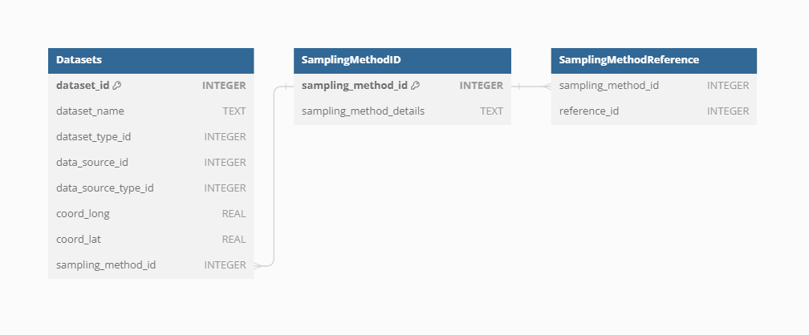
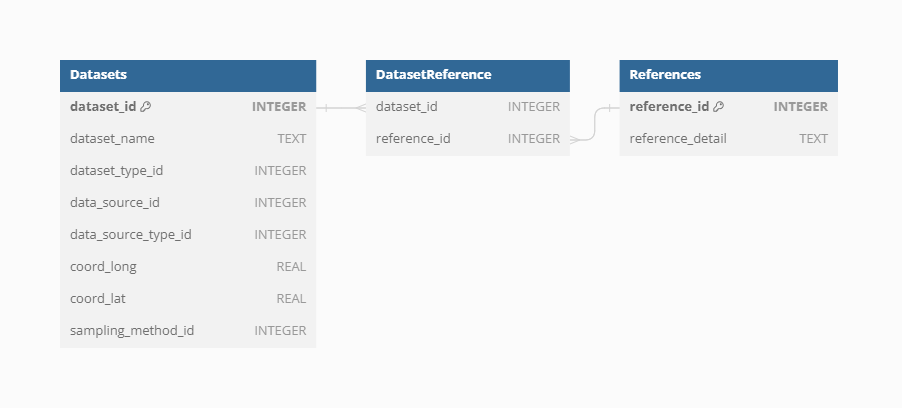

# Section II: Overview of VegVault 1.0.0

## Dataset

The `Dataset` represents the main structure in the VegVault, serving as
the keystone for organizing and managing data. Currently, the VegVault
database holds over 480,000 Datasets (of which approximately 100,000 are
gridpoints, which are artificially created to hold abiotic data, see
details below). Here we will explain some, but not all, of the features
of the `Dataset`.

### Dataset Type

The `Dataset Type` defines the most basic classification of each
`Dataset`, ensuring that the vast amount of data is categorized
systematically. Currently, **VegVault** contains the following types of
Datasets:

- `vegetation_plot`: This type includes current vegetation plot data,
  capturing contemporary vegetation characteristics and distributions.
- `fossil_pollen_archive`: This type encompasses past vegetation plot
  data derived from fossil pollen records, providing insights into
  historical vegetation patterns.
- `traits`: This `Dataset` contains functional trait data, detailing
  specific characteristics of plant species that influence their
  ecological roles.
- `gridpoints`: This type holds artificially created Datasets to manage
  abiotic data, such as climate and soil information

### Dataset Source-Type

Each `Dataset` is derived from a specific `Source-Type` provides
detailed information on the source, which was used to retrieve the
original data, enhancing the findability and referencing of primary data
sources. The current `Source-Types` in **VegVault** include

- **BIEN** - [Botanical Information and Ecology
  Network](https://bien.nceas.ucsb.edu/bien/)
- **sPlotOpen** - [The open-access version of
  sPlot](https://idiv-biodiversity.de/en/splot/splotopen.html)
- **TRY** - [TRY Plant Trait
  Database](https://www.try-db.org/TryWeb/Home.php)
- **FOSSILPOL** - [The workflow that aims to process and standardise
  global palaeoecological pollen
  data](https://hope-uib-bio.github.io/FOSSILPOL-website/). Note that we
  specifically state FOSSILPOL and not Neotoma, as FOSSILPOL not only
  provides the data but also alters it (e.g, new age-depth models).
- **gridpoints** - artificially created `Datasets` to hold abiotic data

### Dataset Source

Each individual `Dataset` from a specific `Dataset` `Source-Type` can
have information on the source of the data (i.e. sub-database). This
should help to promote better findability of the primary source of data
and referencing.

Currently, there are 706 sources of datasets.

### Sampling method

Sampling methods vary significantly across the different types of
`Datasets` integrated into **VegVault**, reflecting the diverse nature
of the data collected. For current vegetation plots, sampling involves
standardized plot inventories and surveys that capture detailed
vegetation characteristics across various regions. In contrast, fossil
pollen data are collected from sediment cores, representing past
vegetation and depositional environments. These sampling methods are
crucial for understanding the context and limitations of each Dataset
Type. Therefore, information on sampling methods is only present for
both `vegetation_plot` and `fossil_pollen_archive` `Datasets`, providing
metadata that ensures accurate and contextually relevant analyses

### References

To support robust and transparent scientific research, each `Dataset` in
**VegVault** can have multiple references at different levels. The
`Dataset` `Source-Type`, `Dataset Source`, and `Sampling Method` can all
have their own references, providing detailed provenance and citation
information. This multi-level referencing system enhances the
traceability and validation of the data. **VegVault** currently includes
706 sources of `Datasets`, each documented to ensure reliability and
ease of use. Each dataset can also have one or more direct references to
specific data, further ensuring that users can accurately cite and
verify the sources of their data.

This means that one dataset can have one/several references from each of
those parts. Let’s take a look at an example, of what that could mean in
practice.

We have selected dataset ID: 91256, which is a fossil pollen archive.
Therefore, it has the reference of the *Dataser Source-Type*:
*https://doi.org/10.1111/geb.13693* and reference for the individual
dataset: *Grimm, E.C., 2008. Neotoma: an ecosystem database for the
Pliocene, Pleistocene, and Holocene. Illinois State Museum Scientific
Papers E Series, 1.*
