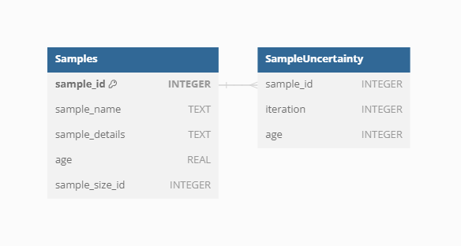

## Samples

`Samples` represent the main unit of data in the **VegVault** database,
serving as the fundamental building blocks for all analyses. There are
currently over 13 millions of `Samples` in the **VegVault** database (of
which ~ 1.6 millions are `gridpoints`, artificially created to hold
abiotic data, see below).

### Dataset-Sample

Each sample is linked to a specific `Dataset` via the `Dataset-Sample`
table, which ensures that every sample is correctly associated with its
corresponding `Dataset Type`, whether it is current `vegetation_plots`,
`fossil_pollen_archive`, `traits`, or `gridpoint`.

### Sample-size

The size of vegetation plots can vary, impacting the analyses and
interpretations of the data. To account for this variability,
information about the plot size is recorded separately for each
`Sample`. This detail is crucial for ecological studies where plot size
can influence species diversity and abundance metrics.

### Sample age

**VegVault** encompasses both current and paleo data, necessitating
accurate age information for each sample. Modern samples are assigned an
age of 0, while paleo samples uses calibrated years before present (cal
yr BP). The “present” is here specified as 1950 AD. In addition, each
`Sample` from `fossil_pollen_archive` `Dataset` is also associated with
an uncertainty matrix. This matrix provides a range of potential ages
derived from age-depth modelling, reflecting the inherent uncertainty in
dating paleoecological records. For instance, we include detailed age
uncertainty information for a fossil pollen archive with an example
`Dataset`.

We can show this on the previously selected fossil pollen archive with
dataset ID: 91256.

### Sample reference

Each `Sample` in **VegVault** can have specific references in addition
to the `Dataset`-level references. These individual `Sample` references
provide detailed provenance and citation information, ensuring that
users can trace the origin and validation of each data point. This level
of referencing enhances the transparency and reliability of the data,
especially when the database continues to be updated in the future.

