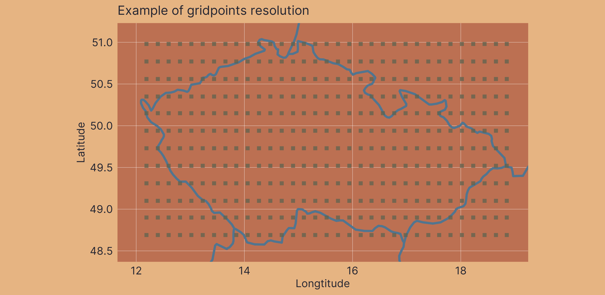
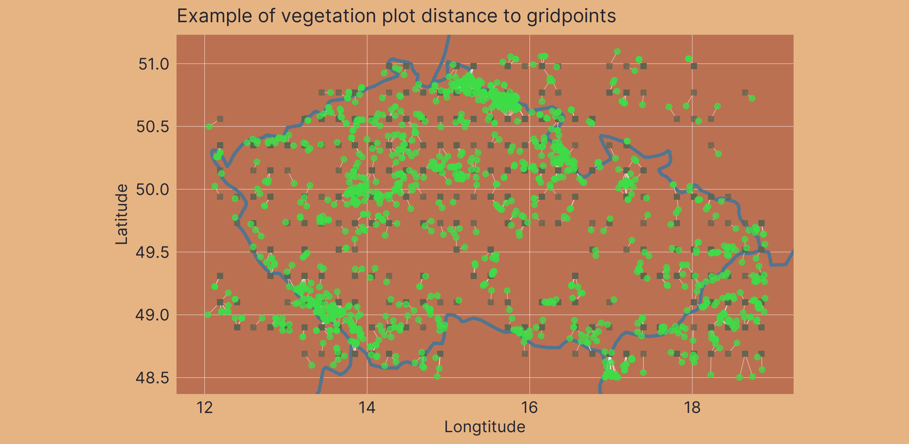

## Abiotic data

The abiotic data in the **VegVault** database provide essential
information on environmental factors affecting vegetation distribution
and traits. These data include variables such as climate and soil
conditions, which are crucial for understanding the ecological contexts
of vegetation dynamics.

Currently, **VegVault** includes abiotic data from
[CHELSA](https://chelsa-climate.org/),
[CHELSA-TRACE21](https://chelsa-climate.org/chelsa-trace21k/), and
[WoSIS](https://www.isric.org/explore/wosis). CHELSA and CHELSA-TRACE21
provide high-resolution climate data, while WoSIS offers detailed soil
information.

<table style="width:99%;">
<colgroup>
<col style="width: 16%" />
<col style="width: 21%" />
<col style="width: 60%" />
</colgroup>
<thead>
<tr class="header">
<th>Variable name</th>
<th>Variable unit</th>
<th>Source of data</th>
</tr>
</thead>
<tbody>
<tr class="odd">
<td>bio1</td>
<td>C (degree Celsius)</td>
<td>mean annual air temperature</td>
</tr>
<tr class="even">
<td>bio4</td>
<td>C (degree Celsius)</td>
<td>temperature seasonality</td>
</tr>
<tr class="odd">
<td>bio6</td>
<td>C (degree Celsius)</td>
<td>mean daily minimum air temperature of the coldest month</td>
</tr>
<tr class="even">
<td>bio12</td>
<td>kg m-2 year-1</td>
<td>annual precipitation amount</td>
</tr>
<tr class="odd">
<td>bio15</td>
<td>Unitless</td>
<td>precipitation seasonality</td>
</tr>
<tr class="even">
<td>bio18</td>
<td>kg m-2 quarter-1</td>
<td>mean monthly precipitation amount of the warmest quarter</td>
</tr>
<tr class="odd">
<td>bio19</td>
<td>kg m-2 quarter-1</td>
<td>mean monthly precipitation amount of the coldest quarter</td>
</tr>
<tr class="even">
<td>HWSD2</td>
<td>Unitless</td>
<td>SoilGrids-soil_class</td>
</tr>
</tbody>
</table>

Because original data are stored as raster, which cannot be stored in
SQLite database, we created artificial points called `gridpoints` in the
middle of each raster cell to represent the data. To unify the varying
resolution of rasters and to limit the amount of data, we resampled all
data into ~ 25km resolution and 500-year slices. This mean that there we
created uniform spatio-temporal matrix of `gridpoints` to hold the
abiotic data. Gridpoints are stored in artificially created `Datasets`
and `Samples`, with one `Dataset` holding more `Samples` only if the
differ in age. Next, we have estimated the spatial and temporal distance
between each `gridpoint` and other non-`gridpoint` `Samples`
(`vegetation_plot`, `fossil_pollen_archive`, and `traits`). We store the
link between `gridpoint` and non-`gridpoint` `Samples` as well as the
spatial and temporal distance. As this result in very amount of data, we
have discarded any `gridpoint` Sample, which is not close to 50 km
and/or 5000 years to any other non-`gridpoint` `Samples` as not relevant
for the vegetation dynamics.

Such data structure allow that environmental context is readily
available for each vegetation and trait `Sample`. while for each
non-`gridpoint` `Sample`, user can select the closest spatio-temporally
abiotic data or get average from all surrounding `gridpoints`.

By providing comprehensive and well-structured abiotic data, VegVault
enhances the ability to study the interactions between vegetation and
their environment, supporting advanced ecological research and modelling
efforts.
